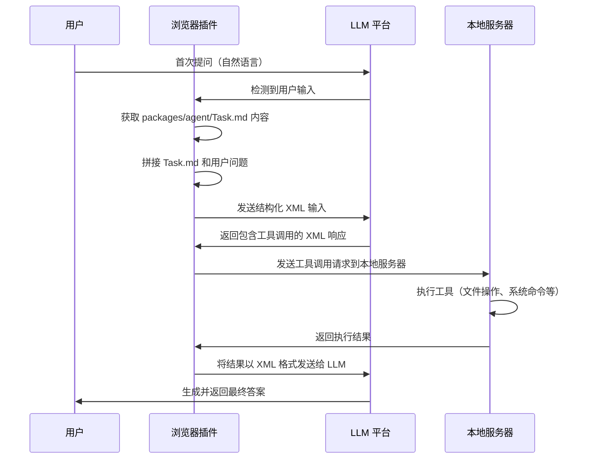

# 浏览器插件 Agent 实现方案

## 项目背景

现有的 packages/agent 项目是一个让 LLM 以结构化输出的系统，它严格规定了工具和输出格式，让 LLM 更加可控。该系统通过 XML 格式的响应来解析和执行工具调用，支持文件操作、系统信息获取、网络搜索等多种功能。

## 要实现的目标

### 核心目标
1. **跨平台 LLM 访问**: 通过浏览器插件访问各个厂商的 LLM 工具（如 DeepSeek、Gemini、ChatGPT 等）
2. **结构化输入转换**: 将用户的自然语言输入转换为符合 Agent 规范的 XML 格式
3. **本地数据交互**: 当 LLM 响应完毕后，调用本地接口实现与本机数据的交互
4. **无缝集成**: 在用户使用各种 LLM 服务时，提供统一的 Agent 能力

### 具体功能需求
- 在各大 LLM 平台（ChatGPT、Claude、Gemini、DeepSeek 等）中注入 Agent 功能
- 提供用户友好的界面来配置 Agent 参数和工具
- 支持自定义工具和本地 API 接口
- 实现安全的本地数据交互机制
- 提供历史记录和配置管理功能

## 技术方案

### 1. 架构设计

```
┌─────────────────┐    ┌─────────────────┐    ┌─────────────────┐
│   浏览器插件     │    │   本地服务器     │    │   LLM 平台      │
│                 │    │                 │    │                 │
│ ┌─────────────┐ │    │ ┌─────────────┐ │    │ ┌─────────────┐ │
│ │ Content     │ │    │ │ API Server  │ │    │ │ ChatGPT     │ │
│ │ Script      │ │◄──►│ │ (Hono)      │ │    │ │ Claude      │ │
│ └─────────────┘ │    │ └─────────────┘ │    │ │ Gemini      │ │
│ ┌─────────────┐ │    │ ┌─────────────┐ │    │ │ DeepSeek    │ │
│ │ Background  │ │    │ │ Agent       │ │    │ │ ...         │ │
│ │ Script      │ │    │ │ Executor    │ │    │ └─────────────┘ │
│ └─────────────┘ │    │ └─────────────┘ │    └─────────────────┘
│ ┌─────────────┐ │    │ ┌─────────────┐ │
│ │ Popup UI    │ │    │ │ Tools       │ │
│ └─────────────┘ │    │ │ Registry    │ │
└─────────────────┘    └─────────────────┘
```

### 2. 核心组件

#### 2.1 浏览器插件组件

**Content Script**
- 注入到各个 LLM 平台的页面中
- 监听用户输入和 LLM 响应
- 提供 Agent 功能按钮和界面
- 与 Background Script 通信

**Background Script**
- 管理插件状态和配置
- 处理与本地服务器的通信
- 管理用户认证和权限
- 处理跨域请求

**Popup UI**
- 提供插件配置界面
- 显示 Agent 状态和历史记录
- 管理工具和 API 配置

#### 2.2 本地服务器组件

**API Server (Hono)**
- 提供 RESTful API 接口
- 处理来自插件的请求
- 管理 Agent 执行器
- 提供工具注册和管理

**Agent Executor**
- 复用现有的 Agent 系统
- 解析 XML 格式的响应
- 执行工具调用
- 返回结构化结果

**Tools Registry**
- 管理可用的工具
- 提供工具注册接口
- 处理工具权限和安全

### 3. 实现流程

#### 3.1 用户交互完整流程



#### 3.2 XML 转换详细过程

1. **首次提问处理**:
   - 插件检测到用户在LLM平台输入问题
   - 调用 `packages/chrome-ext/src/config/prompt.ts` 中的XML规范内容
   - 将结构化 XML 发送给 LLM 平台

2. **LLM响应处理**:
   - LLM返回包含工具调用的XML响应
   - 插件解析XML中的`<tools>`部分
   - 提取需要执行的工具及其参数

3. **本地执行**:
   - 将工具调用请求发送到本地服务器
   - 本地服务器执行相应的工具操作
   - 返回执行结果给插件

4. **结果反馈**:
   - 插件将执行结果包装成XML格式
   - 发送回LLM平台作为`<tools_result>`
   - LLM基于结果生成最终回答

#### 3.3 状态管理

插件需要维护以下状态:
- 是否正在处理用户请求
- 最近一次处理的结果状态
- 与本地服务器的连接状态

### 4. 技术栈选择

#### 4.1 浏览器插件
- **框架**: Manifest V3
- **语言**: TypeScript
- **构建工具**: Vite
- **UI 框架**: React + UnoCSS(TailwindCSS风格)

#### 4.2 本地服务器
- **框架**: Hono
- **语言**: TypeScript

### 5. 安全考虑

#### 5.1 权限管理
- 最小权限原则
- 用户确认机制
- 工具执行权限控制
- 数据访问审计

### 6. 用户体验设计

#### 6.1 界面设计
- 简洁直观的操作界面
- 响应式设计
- 深色/浅色主题支持，使用 TailwindCSS 的 `dark:xxx` 实现，我已完成自动检测深色模式
- 无障碍访问支持

#### 6.2 交互设计
- 一键启用/禁用 Agent
- 实时状态反馈
- 错误提示和恢复
- 操作历史记录

#### 6.3 配置管理
- 可视化配置界面
- 配置导入/导出
- 预设配置模板
- 配置版本管理

---

# UI 设计

## 1. Popup UI 设计

### 1.1 整体布局设计

**尺寸**: 360px × 500px，采用卡片式布局

**布局结构**:
```
┌─────────────────────────────────┐
│  Header (Logo + 状态指示器)        │
├─────────────────────────────────┤
│  Quick Actions (快速操作区)        │
├─────────────────────────────────┤
│  Agent Status (连接状态卡片)       │
├─────────────────────────────────┤
│  Recent Activity (最近活动)        │
└─────────────────────────────────┘
```

### 1.2 具体界面设计

#### Header 区域
- **左侧**: Nexus Agent Logo + 文字标识
- **右侧**: 连接状态指示器（绿色圆点 = 已连接，红色圆点 = 未连接）

#### Quick Actions 区域
```
┌─────────────────────────────────┐
│  🤖 快速操作                      │
├─────────────────────────────────┤
│  [🔧 测试连接] [📁 打开工作目录]    │
│  [⚙️ 设置]    [📊 状态面板]       │
└─────────────────────────────────┘
```

#### Agent Status 卡片
```
┌─────────────────────────────────┐
│  📡 Agent 状态                   │
├─────────────────────────────────┤
│  ● 本地服务器: 已连接             │
│  ● 当前网站: ChatGPT (已启用)     │
│  ● 工作目录: /Users/name/project │
│  ● 最后活动: 2分钟前             │
└─────────────────────────────────┘
```

#### Recent Activity 区域
```
┌─────────────────────────────────┐
│  📝 最近活动                     │
├─────────────────────────────────┤
│  • 创建文件 test.txt (1分钟前)   │
│  • 搜索网络 "天气" (3分钟前)      │
│  • 读取文件 config.json (5分钟前) │
│  [查看全部]                      │
└─────────────────────────────────┘
```

### 1.3 设置页面设计

**设置页面布局**:
```
┌─────────────────────────────────┐
│  ← 返回  |  设置                │
├─────────────────────────────────┤
│  🔗 连接设置                     │
│  ┌─────────────────────────────┐ │
│  │ 服务器地址: [http://localhost:3000] │
│  │ 工作目录:   [/path/to/workspace]   │
│  └─────────────────────────────┘ │
├─────────────────────────────────┤
│  ⚙️ 行为设置                     │
│  ☑️ 自动在支持的网站启用 Agent    │
│  ☑️ 显示处理状态提示             │
│  ☑️ 调试模式                     │
├─────────────────────────────────┤
│  🛠️ 工具管理                     │
│  ☑️ 文件操作  ☑️ 系统信息        │
│  ☑️ 网络搜索  ☑️ 命令执行        │
└─────────────────────────────────┘
```

## 2. 网页交互设计

### 2.1 ChatGPT 界面集成

#### 输入框增强
```
┌─────────────────────────────────┐
│  [用户输入框]                    │
│  ┌─────────────────────────────┐ │
│  │ 帮我创建一个文件...          │ │
│  │ 🤖 Agent 模式已启用          │ │
│  └─────────────────────────────┘ │
│  [发送] [Agent 开关] [设置]      │
└─────────────────────────────────┘
```

#### 消息流增强
```
用户: 帮我创建一个文件
┌─────────────────────────────────┐
│  🤖 Agent 正在处理...            │
│  ● 解析用户请求                  │
│  ● 调用工具: write_file          │
│  ● 执行完成                     │
└─────────────────────────────────┘

ChatGPT: 我已经为您创建了文件...
```

### 2.2 Gemini 界面集成

#### 输入区域增强
```
┌─────────────────────────────────┐
│  [输入框]                       │
│  ┌─────────────────────────────┐ │
│  │ 搜索今天的天气...            │ │
│  │ 🔧 Agent 已准备就绪          │ │
│  └─────────────────────────────┘ │
│  [发送] [⚙️]              │
└─────────────────────────────────┘
```

### 2.3 通用交互元素

#### Agent 状态指示器
- **未启用**: 灰色图标，悬停显示"点击启用 Agent"
- **已启用**: 蓝色图标，悬停显示"Agent 已启用"
- **处理中**: 旋转动画，显示进度条

#### 工具执行提示
```
┌─────────────────────────────────┐
│  🔧 正在执行工具...              │
│  ┌─────────────────────────────┐ │
│  │ 工具: write_file            │ │
│  │ 参数: filePath="test.txt"   │ │
│  │ 进度: ████████░░ 80%        │ │
│  └─────────────────────────────┘ │
│  [取消]                         │
└─────────────────────────────────┘
```

## 3. 用户交互流程

### 3.1 首次使用流程

1. **安装后首次打开**
   - 显示欢迎页面
   - 引导用户配置本地服务器
   - 提供快速设置向导

2. **配置向导**
   ```
   步骤 1: 连接本地服务器
   ┌─────────────────────────────────┐
   │  🚀 欢迎使用 Nexus Agent!       │
   ├─────────────────────────────────┤
   │  首先，我们需要连接到您的本地   │
   │  服务器来执行工具操作。         │
   │                                │
   │  服务器地址: [http://localhost:3000] │
   │  [测试连接] [下一步]            │
   └─────────────────────────────────┘
   ```

3. **工作目录设置**
   ```
   步骤 2: 设置工作目录
   ┌─────────────────────────────────┐
   │  📁 设置工作目录                │
   ├─────────────────────────────────┤
   │  请选择 Agent 可以操作的文件    │
   │  目录，建议选择您的项目目录。   │
   │                                │
   │  工作目录: [/Users/name/project] │
   │  [浏览] [下一步]                │
   └─────────────────────────────────┘
   ```

### 3.2 日常使用流程

#### 启用 Agent
1. **自动检测**: 访问支持的 LLM 网站时自动检测
2. **手动启用**: 点击输入框旁的 Agent 图标
3. **状态提示**: 显示"Agent 已启用"的绿色提示

#### 使用 Agent
1. **输入问题**: 用户正常输入自然语言问题
2. **自动转换**: 插件自动将问题转换为 XML 格式
3. **工具执行**: 显示工具执行进度
4. **结果返回**: LLM 基于工具结果回答

#### 查看历史
1. **活动记录**: 在 popup 中查看最近的活动
2. **详细信息**: 点击活动项查看详细信息
3. **重新执行**: 可以重新执行之前的工具调用

### 3.3 错误处理交互

#### 连接失败
```
┌─────────────────────────────────┐
│  ❌ 连接失败                     │
├─────────────────────────────────┤
│  无法连接到本地服务器            │
│  请检查:                        │
│  • 服务器是否正在运行           │
│  • 地址是否正确                 │
│  • 端口是否被占用               │
│                                │
│  [重试] [设置] [帮助]           │
└─────────────────────────────────┘
```

#### 工具执行失败
```
┌─────────────────────────────────┐
│  ⚠️ 工具执行失败                 │
├─────────────────────────────────┤
│  工具: write_file               │
│  错误: 权限不足                 │
│                                │
│  [重试] [查看详情] [忽略]       │
└─────────────────────────────────┘
```

## 4. 视觉设计风格

### 4.1 色彩方案
- **主色调**: 蓝色 (#3B82F6) - 代表 AI 和科技感
- **成功色**: 绿色 (#10B981) - 连接成功、执行成功
- **警告色**: 橙色 (#F59E0B) - 处理中、需要注意
- **错误色**: 红色 (#EF4444) - 连接失败、执行失败
- **中性色**: 灰色系 - 背景、边框、文字

### 4.2 图标设计
- **Agent 图标**: 机器人头像，简洁现代
- **状态图标**: 圆点 + 状态文字
- **工具图标**: 功能相关的简洁图标
- **操作图标**: 标准 Material Design 图标

### 4.3 动画效果
- **加载动画**: 旋转的齿轮图标
- **状态切换**: 平滑的颜色过渡
- **进度条**: 渐变色填充动画
- **提示框**: 淡入淡出效果
